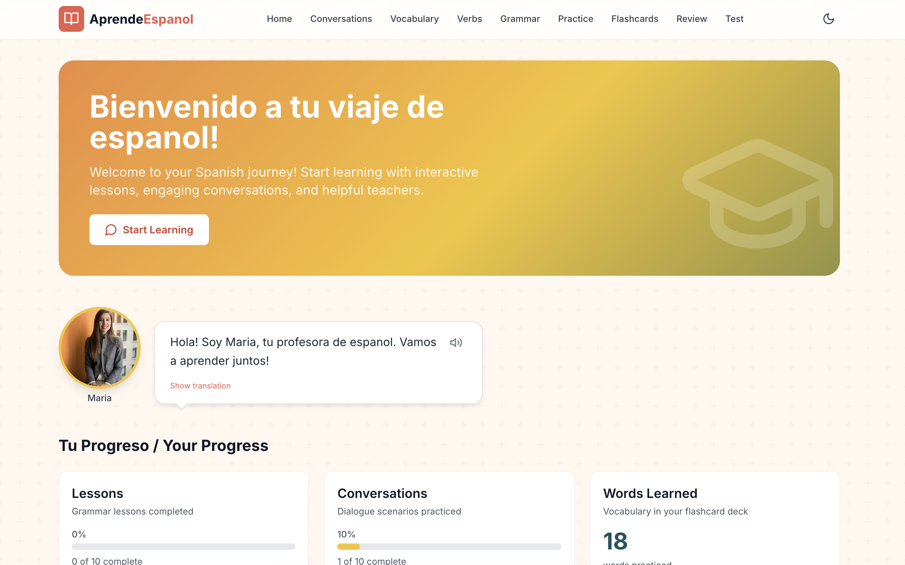
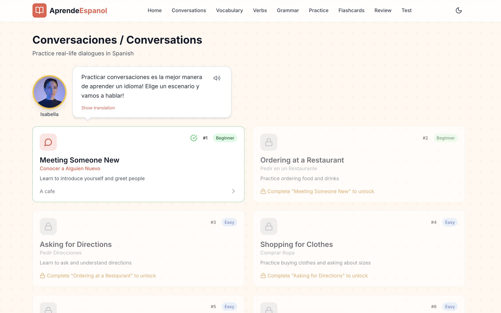
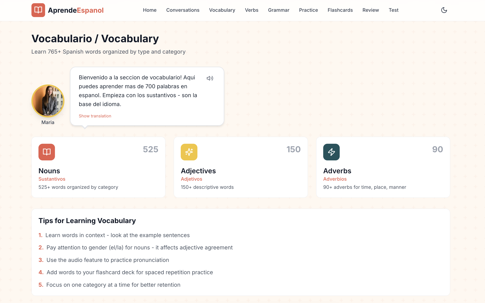
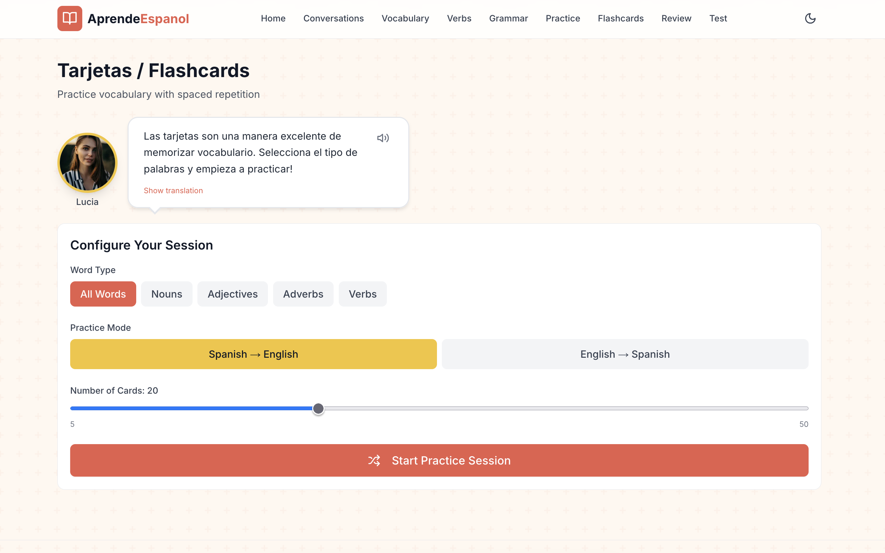

# AprendeEspañol

An interactive Spanish learning web application for A1-level beginners, with a Peru-leaning Latin American dialect anchor.


## Screenshots

<p align="center">
  
  
</p>
<p align="center">
  
  
</p>

> See the [screenshots folder](./screenshots/) for more images and instructions on capturing your own.

## Features

### Vocabulary
- **500+ Spanish words** organized by category (family, food, animals, colors, and more)
- Nouns with gender and plural forms
- Adjectives and adverbs
- Example sentences with translations
- Text-to-speech pronunciation

### Verb Conjugations
- **155+ Spanish verbs** with full conjugation tables
- Present, preterite, imperfect, future, and conditional tenses
- Regular, irregular, stem-changing, and reflexive verbs
- Search and filter functionality
- Gerund and past participle forms

### Grammar Lessons
- **90+ structured lessons** for A1-level learners
- Interactive multi-step format: narrative → discover → explain → practice → drag-order → fill-table → color-match
- Instant feedback on every exercise

### Conversation Practice
- **23 real-life dialogue scenarios** (17 everyday + 6 cultural-immersion)
- Progressive unlock — finish one to open the next
- Multiple response choices with feedback and cultural notes

### Conversation Cards
- Topic cards and "what would you say?" scenarios for free-response practice
- Three-tier scaffolding that adapts as you complete more cards

### Flashcards (SM-2 SRS)
- SuperMemo 2 spaced repetition algorithm
- 4-grade quality rating (Again / Hard / Got It / Easy)
- Review-due queue with status badges (learning / review / mastered)
- Practice Spanish→English or English→Spanish

### Numbers & Time Drills
- Number recognition (0–1000)
- Telling time in Spanish
- Days, months, and seasons
- Math problems in Spanish (with `más`/`menos`/`por`)

### Stories & Reading
- 35+ graded stories with comprehension questions
- "Mad Libs" fill-in-the-blank stories
- Image-description prompts and story-retelling exercises

### Cultural Content
- Latin American holidays page (Peru-anchored): Inti Raymi, Señor de los Milagros, Día de la Madre, Fiestas Patrias, Candelaria, Año Nuevo, and more
- "Day in the life" narratives, vocabulary, and useful phrases per holiday
- Cultural notes embedded inline in conversation scenarios

### Gamification
- XP awarded per exercise, scaled by source
- 10 levels with Spanish titles (Principiante → Virtuoso)
- Daily streak tracking with optional notifications
- 24 achievements across milestone, streak, mastery, exploration, and special categories
- Adaptive recommendations based on per-skill accuracy

### Guitar & Spanish
- 8 original Spanish songs with chord diagrams, strum patterns, tablature, and lyric translations
- Web Audio API chord playback with adjustable tempo

### Worksheets
- PDF worksheet generation via a Python (ReportLab) helper
- Configurable section mix: vocab matching, fill-in-the-blank, conjugation, translation

### Other
- Dark/light theme + colour scheme picker (default / Peru / Mexico / Colombia / Argentina)
- Progress persistence in `localStorage` with schema-version migrations
- Mobile-responsive layout

## Getting Started

### Prerequisites

- Node.js 18+ and npm
- Python 3 + ReportLab (only if you want PDF worksheet generation): `pip install reportlab`

### Installation

```bash
git clone https://github.com/erimar77/aprende-espanol.git
cd aprende-espanol
npm install
cp .env.example .env.local
```

### Configuration

`.env.local` controls auth and TTS. The app runs fine without any of these (auth is currently disabled in the UI, TTS falls back to the browser Web Speech API):

```bash
# NextAuth (required only if you're wiring auth back up)
NEXTAUTH_URL=http://localhost:3000
NEXTAUTH_SECRET=  # generate with: openssl rand -base64 32
ADMIN_EMAIL=

# OAuth provider credentials (configure whichever you want enabled)
GOOGLE_CLIENT_ID=
GOOGLE_CLIENT_SECRET=
GITHUB_CLIENT_ID=
GITHUB_CLIENT_SECRET=
DISCORD_CLIENT_ID=
DISCORD_CLIENT_SECRET=

# Optional: ElevenLabs premium TTS — leave blank to use the browser Web Speech API.
ELEVENLABS_API_KEY=
```

### Running

```bash
npm run dev          # dev server (Turbopack)
npm run build        # production build
npm start            # serve the production build
npm test             # run Vitest test suite
npm run test:watch   # watch mode
npm run lint         # next lint
```

Open [http://localhost:3000](http://localhost:3000).

## Project Structure

```
aprende-espanol/
├── app/                      # Next.js App Router pages
│   ├── page.tsx              # Homepage
│   ├── grammar/              # Grammar lessons
│   ├── flashcards/           # SM-2 SRS flashcards
│   ├── conversations/        # Dialogue scenarios
│   ├── conversation-cards/   # Free-response topic cards
│   ├── daily-practice/       # 3-stage daily streak session
│   ├── verbs/, /verb-trainer/
│   ├── vocabulary/           # Browse nouns/adjectives/adverbs
│   ├── phrases/              # Phrase bank
│   ├── stories/              # Graded readers
│   ├── numbers-time/         # Numbers/time/dates drills
│   ├── culture/              # Holiday calendar with day-in-the-life narratives
│   ├── workshop/             # Mixed-format fluency sessions
│   ├── guitarra/             # Spanish songs with chords
│   ├── dashboard/            # XP / streak / skill stats
│   ├── settings/
│   └── api/                  # Route handlers (auth, tts, worksheet, admin)
├── components/
│   ├── ui/                   # Reusable UI primitives
│   ├── grammar/              # InteractiveLessonView + 7 step renderers
│   └── layout/               # Header etc.
├── context/                  # React Context providers
│   ├── AuthContext           # OAuth session (currently stubbed)
│   ├── ProgressContext       # Lesson/conversation/flashcard progress
│   ├── GamificationContext   # XP, streaks, achievements
│   └── ThemeContext          # Dark/light + colour scheme
├── data/                     # All Spanish/English content (~17k lines)
│   ├── DIALECT.md            # Regional target documentation
│   ├── nouns.ts, adjectives.ts, adverbs.ts, verbs.ts
│   ├── grammar-lessons.ts    # 90+ multi-step lessons
│   ├── conversations.ts      # Dialogue scenarios with cultural notes
│   ├── stories.ts, madlibs.ts, narration-prompts.ts
│   ├── topic-cards.ts        # Conversation-card prompts
│   ├── latin-holidays.ts     # Cultural calendar
│   ├── number-drills.ts, daily-phrases.ts, ...
│   └── word-relations.ts     # Synonyms/antonyms for flashcards
├── lib/
│   ├── sm2.ts                # SuperMemo 2 algorithm
│   ├── sm2.test.ts           # 20 test cases
│   ├── gamification.ts       # XP, levels, streaks, achievements, recommendations
│   ├── gamification.test.ts  # 31 test cases
│   ├── storage.ts, storage-keys.ts
│   ├── server-auth.ts        # Shared admin-check helper
│   ├── speech.ts, chord-audio.ts, rate-limit.ts, db.ts
│   └── types.ts
├── hooks/                    # useNotifications, etc.
├── scripts/
│   └── generate-worksheet.py # PDF generation (ReportLab)
└── public/                   # Static assets
```

## Dialect

All Spanish content targets **Latin American Spanish, Peru-leaning, tuteo-only** — no `vosotros`, no `vos`. Currency is soles. Spain-specific scenes (Granada tapas, etc.) are marked explicitly. See [`data/DIALECT.md`](./data/DIALECT.md) for the full style guide.

## Tech Stack

- **Framework:** [Next.js 15](https://nextjs.org/) with App Router (Turbopack in dev)
- **Language:** [TypeScript 5](https://www.typescriptlang.org/) in strict mode
- **Styling:** [Tailwind CSS](https://tailwindcss.com/)
- **Icons:** [Lucide React](https://lucide.dev/)
- **Authentication:** [NextAuth.js v5](https://authjs.dev/) (handler mounted; client UI currently disabled)
- **Text-to-Speech:** Browser Web Speech API with optional [ElevenLabs](https://elevenlabs.io/) integration
- **State:** React Context API
- **Storage:** Browser `localStorage` + JSON file database (`data/db/`, gitignored)
- **Testing:** [Vitest](https://vitest.dev/) (pure-function tests for SM-2 and gamification)

## License

MIT — see the [LICENSE](LICENSE) file.

## Acknowledgments

- Icons from [Lucide](https://lucide.dev/)
- Built with [Next.js](https://nextjs.org/) and [Tailwind CSS](https://tailwindcss.com/)
